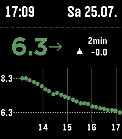
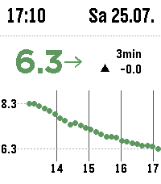
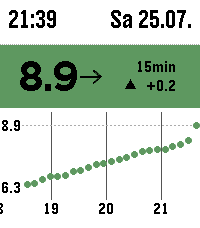

# OpenLibreLinkUp

            

> [Deutsche Version](#deutsche-version)

A complete glucose-monitoring watchface for the **Pebble Time 2**.  
OpenLibreLinkUp displays readings from a **FreeStyle Libre sensor** through the
unofficial **LibreLinkUp API**.

> **Project status:** Feature-complete and ready for daily use. Future changes
> will focus on maintenance, compatibility, and bug fixes.

OpenLibreLinkUp is based on
[T1000 Color](https://github.com/andrewchilds/t1000-color) by
[Andrew Childs](https://github.com/andrewchilds). The LibreLinkUp integration,
Pebble Time 2 interface, chart, settings, alarms, and further modifications are
maintained by **Marukitano**.

## Features

- Current glucose value
- Configurable colors for good, warning, and alarm ranges
- Trend arrow in the same color as the current glucose value
- Change since the previous reading
- Age of the latest sensor reading
- Rolling four-hour glucose chart
- Dynamic chart scaling with min/max labels
- Moving full-hour grid and hour labels
- Configurable low and high thresholds
- Support for `mmol/L` and `mg/dL`
- Black-on-white and white-on-black display modes
- Configurable update interval from 1 to 10 minutes
- Low-soon prediction alarm
- Delayed and repeating high-glucose alarm
- Acoustic alarms on the Pebble Time 2
- Vibration fallback when sound is unavailable or muted
- Connection and stale-data indicators
- Configurable settings through the Pebble phone application

## Requirements

- Pebble Time 2
- FreeStyle Libre sensor
- LibreLinkUp account
- An active LibreLinkUp shared connection
- Pebble phone application with an internet connection
- Pebble SDK for building from source

## Installation from source

Clone the repository and install the dependencies:

```sh
git clone https://github.com/marukitano/OpenLibreLinkUp.git
cd OpenLibreLinkUp
npm install
```

Build the watchface:

```sh
npm run build
```

Enable **Developer Connection** in the Pebble phone application and install the
generated PBW file:

```sh
pebble install --phone PHONE_IP build/*.pbw
```

Replace `PHONE_IP` with the address shown under Developer Connection.

## Configuration

Open the settings for **OpenLibreLinkUp** in the Pebble phone application.

The settings page contains:

- LibreLinkUp email address and password
- LibreLinkUp server region
- Glucose unit
- Update interval
- Low and high chart thresholds
- Good, warning, and alarm colors
- Low-soon alarm threshold and repeat interval
- High-glucose alarm threshold, delay, and repeat interval
- Reversed display mode

## Alarms

### Low-soon alarm

The watchface estimates the glucose trend from recent readings. It can play an
alarm when the predicted value for the next 20 minutes falls below the
configured threshold.

### High-glucose alarm

The high alarm can be delayed so that a brief high reading does not immediately
trigger it. The alarm can repeat at a configurable interval while the high
condition remains active.

On the Pebble Time 2, alarms use the built-in speaker. Vibration is used as a
fallback when sound is muted or unavailable.

## Security and privacy

Never commit LibreLinkUp credentials, access tokens, personal glucose data, or
`emu-settings.json` to the repository.

Credentials entered through the settings page are stored by the Pebble phone
application. OpenLibreLinkUp is an unofficial client and uses the LibreLinkUp
API directly from PebbleKit JS.

## Disclaimer

OpenLibreLinkUp is an independent, unofficial hobby project. It is not
affiliated with, endorsed by, or supported by Abbott, FreeStyle Libre,
LibreLinkUp, Core Devices, Rebble, or Pebble.

The displayed glucose values are intended for convenient viewing only. Do not
use this watchface as the sole basis for medical decisions. Always follow the
instructions provided with your glucose-monitoring system.

## Credits

Original project:

- [T1000 Color](https://github.com/andrewchilds/t1000-color)
- Copyright © 2026 Andrew Childs

LibreLinkUp integration and modifications:

- **Marukitano**
- Copyright © 2026 Maru

## License

OpenLibreLinkUp is licensed under the [MIT License](LICENSE).

The original copyright notice and permission notice must remain included in
copies or substantial portions of the software.
---

# Deutsche Version

## OpenLibreLinkUp

Ein vollständiges Blutzucker-Watchface für die **Pebble Time 2**.  
OpenLibreLinkUp zeigt Messwerte eines **FreeStyle-Libre-Sensors** über die
inoffizielle **LibreLinkUp-API** an.

> **Projektstatus:** Funktionsumfang abgeschlossen und für die tägliche Nutzung
> bereit. Künftige Änderungen konzentrieren sich auf Wartung, Kompatibilität
> und Fehlerbehebungen.

OpenLibreLinkUp basiert auf
[T1000 Color](https://github.com/andrewchilds/t1000-color) von
[Andrew Childs](https://github.com/andrewchilds). Die LibreLinkUp-Anbindung,
die Oberfläche für die Pebble Time 2, das Diagramm, die Einstellungen, die
Alarme und alle weiteren Anpassungen werden von **Marukitano** gepflegt.

## Funktionen

- Anzeige des aktuellen Glukosewerts
- Einstellbare Farben für den guten, warnenden und kritischen Bereich
- Trendpfeil in derselben Farbe wie der aktuelle Glukosewert
- Änderung seit der vorherigen Messung
- Alter des letzten Sensorwerts
- Rollendes Vier-Stunden-Diagramm
- Dynamische Skalierung mit Min-/Max-Anzeige
- Mitlaufendes Stundenraster mit Stundenbeschriftung
- Einstellbare untere und obere Grenzwerte
- Unterstützung für `mmol/L` und `mg/dL`
- Weisse Schrift auf schwarzem Hintergrund oder umgekehrte Darstellung
- Einstellbares Aktualisierungsintervall von 1 bis 10 Minuten
- Vorhersagealarm bei drohendem Unterzucker
- Verzögerter und wiederholbarer Alarm bei hohem Glukosewert
- Akustische Alarme auf der Pebble Time 2
- Vibrationsalarm als Ersatz, wenn der Ton stummgeschaltet oder nicht verfügbar ist
- Hinweise bei Verbindungsproblemen und veralteten Messwerten
- Konfiguration über die Pebble-App auf dem Smartphone

## Voraussetzungen

- Pebble Time 2
- FreeStyle-Libre-Sensor
- LibreLinkUp-Konto
- Aktive Freigabeverbindung in LibreLinkUp
- Pebble-App auf dem Smartphone mit Internetverbindung
- Pebble SDK zum Bauen aus dem Quellcode

## Installation aus dem Quellcode

Repository klonen und Abhängigkeiten installieren:

```sh
git clone https://github.com/marukitano/OpenLibreLinkUp.git
cd OpenLibreLinkUp
npm install
```

Watchface bauen:

```sh
npm run build
```

In der Pebble-App die **Developer Connection** aktivieren und anschließend die
erzeugte PBW-Datei installieren:

```sh
pebble install --phone PHONE_IP build/*.pbw
```

`PHONE_IP` durch die Adresse ersetzen, die unter Developer Connection angezeigt
wird.

## Konfiguration

In der Pebble-App die Einstellungen von **OpenLibreLinkUp** öffnen.

Dort können folgende Werte eingestellt werden:

- LibreLinkUp-E-Mail-Adresse und Passwort
- LibreLinkUp-Serverregion
- Einheit des Glukosewerts
- Aktualisierungsintervall
- Unterer und oberer Grenzwert des Diagramms
- Farben für guten, warnenden und kritischen Bereich
- Grenzwert und Wiederholungsintervall des Unterzucker-Voralarms
- Grenzwert, Verzögerung und Wiederholungsintervall des Hochalarms
- Umgekehrte Darstellung

## Alarme

### Vorhersagealarm bei drohendem Unterzucker

Das Watchface berechnet aus den letzten Messwerten einen Glukosetrend. Es kann
einen Alarm ausgeben, wenn der für die kommenden 20 Minuten vorhergesagte Wert
unter den eingestellten Grenzwert fällt.

### Alarm bei hohem Glukosewert

Der Hochalarm kann verzögert werden, damit ein kurzzeitig hoher Wert nicht
sofort einen Alarm auslöst. Solange der hohe Wert bestehen bleibt, kann der
Alarm in einem einstellbaren Abstand wiederholt werden.

Auf der Pebble Time 2 werden die Alarme über den eingebauten Lautsprecher
ausgegeben. Ist der Ton stummgeschaltet oder nicht verfügbar, wird ersatzweise
vibriert.

## Sicherheit und Datenschutz

LibreLinkUp-Zugangsdaten, Zugriffstoken, persönliche Glukosedaten und die Datei
`emu-settings.json` dürfen nicht in das Repository hochgeladen werden.

Die über die Einstellungsseite eingegebenen Zugangsdaten werden von der
Pebble-App auf dem Smartphone gespeichert. OpenLibreLinkUp ist ein
inoffizieller Client und greift über PebbleKit JS direkt auf die LibreLinkUp-API
zu.

## Haftungsausschluss

OpenLibreLinkUp ist ein unabhängiges, inoffizielles Hobbyprojekt. Es steht in
keiner Verbindung zu Abbott, FreeStyle Libre, LibreLinkUp, Core Devices,
Rebble oder Pebble und wird von diesen weder unterstützt noch offiziell
empfohlen.

Die dargestellten Glukosewerte dienen ausschließlich der komfortablen Anzeige.
Das Watchface darf nicht als alleinige Grundlage für medizinische
Entscheidungen verwendet werden. Beachte immer die Anweisungen deines
Glukosemesssystems.

## Danksagung

Ursprüngliches Projekt:

- [T1000 Color](https://github.com/andrewchilds/t1000-color)
- Copyright © 2026 Andrew Childs

LibreLinkUp-Anbindung und Anpassungen:

- **Marukitano**
- Copyright © 2026 Maru

## Lizenz

OpenLibreLinkUp steht unter der [MIT-Lizenz](LICENSE).

Der ursprüngliche Copyright-Hinweis und der Lizenztext müssen in Kopien oder
wesentlichen Teilen der Software enthalten bleiben.
